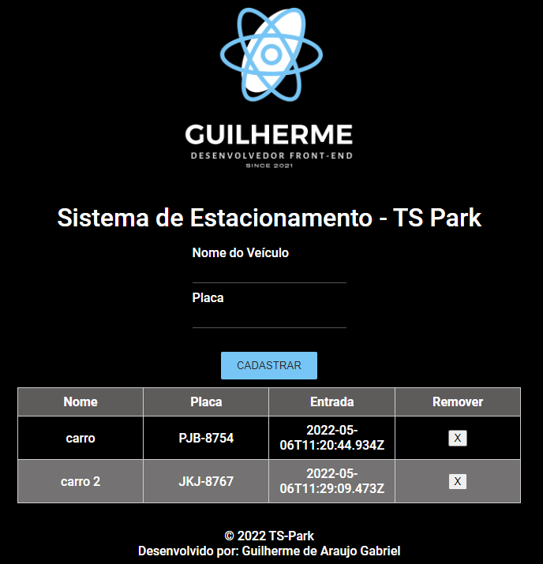
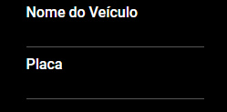
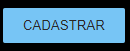
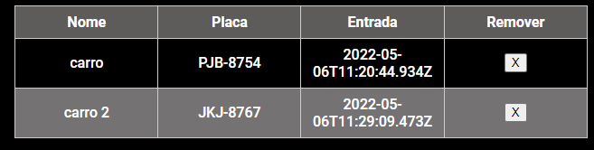

# Projeto Sistema de Estacionamento usando TypeScript

O objetivo desse projeto foi colocar em prática os conhecimentos adquiridos durante o curso da [Digital Innovation One](https://www.dio.me/).

## Tecnologias utilizadas

- HTML.
  
- CSS.
  
- TypeScript.
  
## Preview do projeto

Preview.

## Como testar o projeto

### Clone o repositório e abra remotamente

Digite no seu terminal

``
git clone https://github.com/guilhermag/dio-sistema-estacionamento-ts.git
``

``
cd dio-sistema-estacionamento-ts/
``

Agora é só abrir o ``index.html``.

### Modo de funcionamento

O funcionamento do sistema é bem simples, existem os campos para serem preenchidos com o nome do carro e a sua placa.

O botão para confirmação do cadastro.

Na tabela do pátio é possível remover os carros.

## Créditos

Desenvolvido por Guilherme de Araujo Gabriel.
